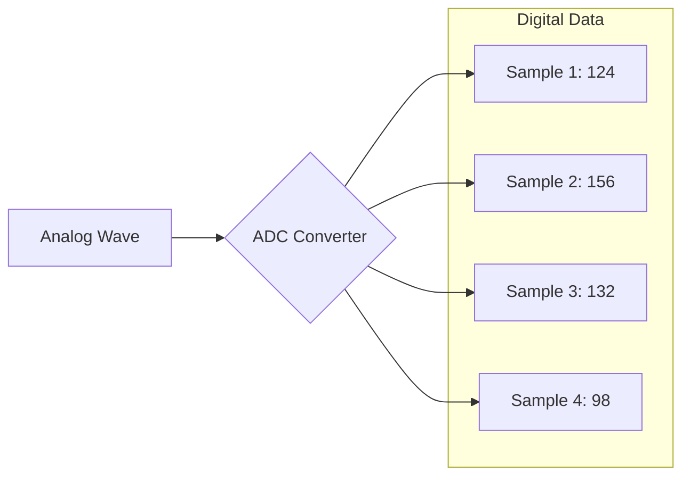
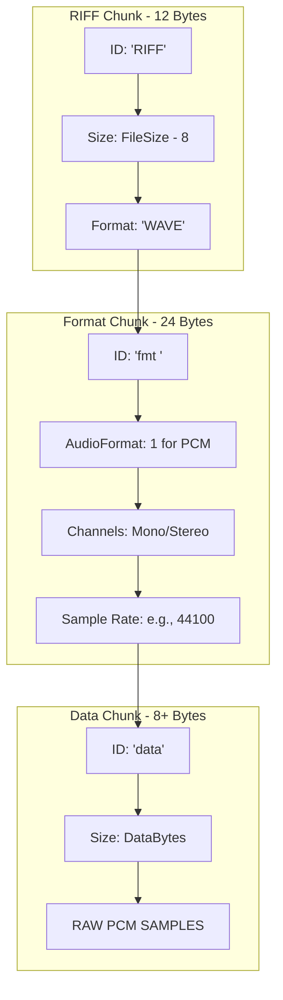

# 🔊 The Definitive Guide to WAV & PCM Audio Architecture

This document provides a comprehensive technical breakdown of the Waveform Audio File Format (WAV) and the underlying Pulse Code Modulation (PCM) theory.

---

## 1. The Theory: Pulse Code Modulation (PCM)
PCM is the standard method for converting analog sound (continuous air pressure waves) into digital data (discrete numbers).

* **The Concept:** Think of PCM as a "Connect the Dots" drawing. The more dots you have, the more the drawing looks like the original curve.
* **Sampling (The Horizontal Axis):** * The process of taking "snapshots" of a sound wave at fixed time intervals.
    * **Sample Rate:** Measured in Hertz (Hz). 44,100 Hz means the system takes 44,100 snapshots every second. This determines the maximum frequency (pitch) the file can represent.
* **Quantization (The Vertical Axis):** * Assigning a numerical value to the amplitude (volume) of each snapshot.
    * **Bit Depth:** The precision of each number. 16-bit provides 65,536 possible volume levels. Higher bit depth reduces digital noise and increases dynamic range.

### Visualizing PCM Sampling

---

## 2. The Purpose of the WAV Header
### Why do we need it?
A raw audio data stream is just a massive pile of binary numbers. Without a header, a computer is "blind":
1. **Speed:** It wouldn't know if it should play 8,000 or 192,000 samples per second.
2. **Resolution:** It wouldn't know if every 2 bytes or every 4 bytes represent a single sound.
3. **Logic:** It wouldn't know which numbers belong to the Left ear and which belong to the Right.

### How the System Uses it
When you open a `.wav` file, the OS or audio player reads the first 44 bytes first. It uses this "metadata" to "prime" the Sound Card (Hardware) with the correct clock speed and bit-depth before a single note is ever played.

---

## 3. The Anatomy of a WAV Header (44 Bytes)
WAV is a subset of the **RIFF** (Resource Interchange File Format) standard. It is organized into three "chunks."

### A. The RIFF Container (Bytes 0-11)
* **`ChunkID`**: Always `"RIFF"`. Identifies the file as a multimedia container.
* **`ChunkSize`**: Total file size minus 8 bytes.
* **`Format`**: Always `"WAVE"`. Specifies that this RIFF container holds audio.

### B. The Format Sub-chunk (The Recipe) (Bytes 12-35)
This is the instruction manual for the audio data.
* **`AudioFormat`**: PCM is **1**. Any other number indicates compression (like MP3 or ADPCM).
* **`NumChannels`**: 1 for Mono, 2 for Stereo.
* **`SampleRate`**: The "Frequency" (e.g., 44100).
* **`BitsPerSample`**: The "Resolution" (e.g., 16, 24).
* **`BlockAlign`**: The size of **one full snapshot** (all channels combined). 
    * *Formula:* `NumChannels * (BitsPerSample / 8)`
* **`ByteRate`**: The "Data Velocity." 
    * *Formula:* `SampleRate * BlockAlign`

### C. The Data Sub-chunk (The Payload) (Bytes 36-43+)
* **`Subchunk2ID`**: Always `"data"`.
* **`Subchunk2Size`**: The total byte count of the raw PCM audio data.

---

## 4. Programming Logic & Concepts in C

### Memory Geometry
* **Interleaving:** In Stereo, snapshots are stored side-by-side: `[Left][Right][Left][Right]`. 
* **Endianness:** WAV is **Little-Endian** (Least Significant Byte first). Since most modern CPUs (Intel/AMD) are also Little-Endian, `fread()` in C maps the file data directly into variables without manual conversion.

### Essential Formulas for Developers
| Goal | Formula |
| :--- | :--- |
| **Total Duration (sec)** | `Subchunk2Size / ByteRate` |
| **Total Samples** | `Subchunk2Size / BlockAlign` |
| **Bytes Per Sample** | `BitsPerSample / 8` |

---

## 5. The Linux Audio Context (ALSA)
When processing audio on Linux, there is a boundary between the file and the hardware:
1. **The Program (C):** Fetches binary data from the disk using `fopen` and `fread`.
2. **ALSA (Advanced Linux Sound Architecture):** The API that takes your PCM data and pushes it to the Sound Card.
3. **The Connection:** You read the header in C, then pass those variables (`SampleRate`, `Channels`) to ALSA to tell the hardware exactly how to handle the raw data stream.

---

### Pro-Tip for Future Reference
If you ever encounter "static" or "white noise" while programming, check your **Block Align**. If you read an odd number of bytes in a stereo file, you will "de-sync" the left and right ears, resulting in immediate audio corruption.