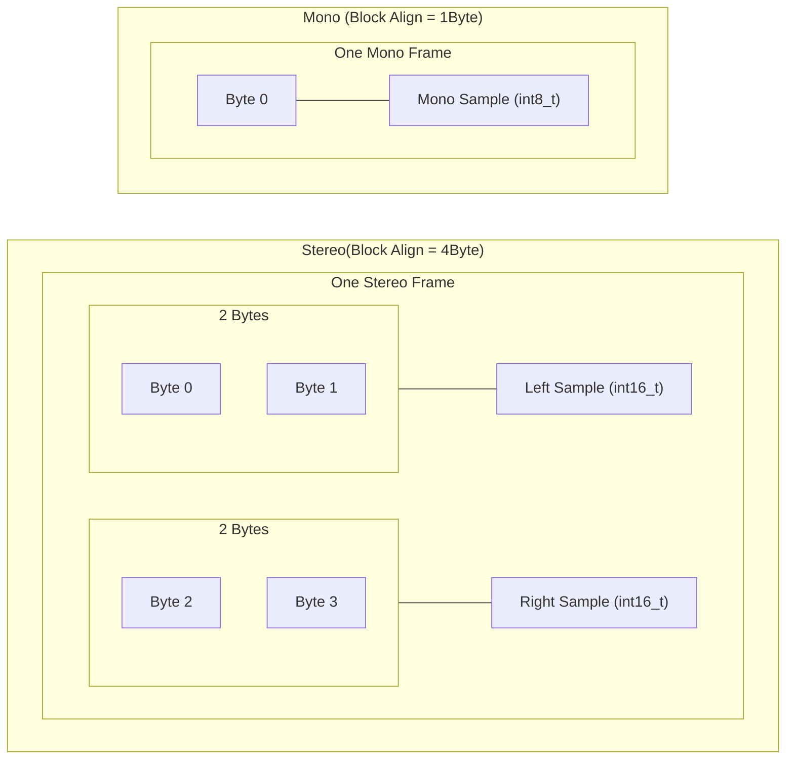

# Deep Analysis: Audio Volume Control (`vol_control.c`)

This document explains the technical logic behind the audio gain control program, focusing on data types, memory management, and audio channel handling.


---

## 1. Why `uint8_t`, `uint16_t`, and `uint32_t`?

In systems programming (like C), standard types like `int` or `short` can have different sizes depending on the computer (32-bit vs 64-bit). For file formats like **WAV**, this is a problem because the file header expects **exact** byte sizes.

### In `wav_header_t` (The Binary Contract)
- **`uint8_t riff[4]`**: Exactly 1 byte per character. Used for tags like "RIFF" and "WAVE".
- **`uint16_t audio_format`**: Exactly 2 bytes. The WAV spec defines this field as 16-bit.
- **`uint32_t sample_rate`**: Exactly 4 bytes. Required to correctly read the frequency (e.g., 44100).

> [!IMPORTANT]
> Using these types ensures that individual fields in your `struct` line up perfectly with the bytes in the file. If you used `int`, the program might read the wrong number of bytes and "miss" the data.

### In Data Reading/Writing
- **`uint8_t*` / `int8_t*`**: We use this to read the **raw bytes** from the disk. Since 1 byte is the smallest unit of memory, treating the whole audio chunk as an array of 8-bit bytes allows us to allocate exactly the right amount of memory (e.g., `malloc(data_size)`).

---

## 2. The "Double Frame" Mystery (16-bit Reading)

The user asked: *"Why are we reading 16 bits somewhere if the sample size is the same?"*

### The Casting Logic
When you read audio data, it starts as a "bucket" of bytes (`int8_t*`). 
- **8-bit Audio**: 1 sample = 1 byte.
- **16-bit Audio**: 1 sample = 2 bytes.

In the code (Line 211):
```c
int16_t* samples = (int16_t*)data;
```
This **Pointer Casting** tells the CPU: *"Don't look at this memory 1 byte at a time. Look at it 2 bytes at a time."*

| Byte Address | 0x01 | 0x02 | 0x03 | 0x04 |
| :--- | :---: | :---: | :---: | :---: |
| **`int8_t*` View** | [Byte A] | [Byte B] | [Byte C] | [Byte D] |
| **`int16_t*` View** | \--- Sample 1 --- | \--- Sample 2 --- |

- Even though the file is still a stream of bits, the `int16_t` type automatically groups two 8-bit pieces into one 16-bit number.

---

## 3. Stereo vs. Mono: How it Works

### Memory Layout
- **Mono**: `[Sample 1][Sample 2][Sample 3]...`
- **Stereo**: `[Left 1][Right 1][Left 2][Right 2]...`

### Why separate them?
We don't "pass the same sample" to both because stereo audio usually contains **different** sounds in each ear (soundstage/panning). 

In `apply_gain_stereo` (Line 121):
```c
for (size_t i = 0; i < num_frames * 2; i++)
```
We multiply by 2 because one "frame" in stereo contains **two** samples (Left + Right). The loop processes them one after another.

### "What If?" Scenario: Mismatches
1. **Treating Stereo as Mono**: If you tell the program a Stereo file is Mono, it will process the samples one-by-one, but it will think it's finished halfway through (because `num_samples` would be calculated based on 1 channel).
2. **The 10-byte Frame (User Example)**: 
   - If a file has a 10-byte frame (e.g., 5 channels of 16-bit audio), the code's `if` conditions (Lines 210, 215, 221) will **all fail**.
   - The program will reach the `else` block (Line 226) and print: `Error: Unsupported format`. It won't crash; it will safely reject it.

---

## 4. Visualizing "Block Align"

The `block_align` header field tells us the size of one complete **Frame**.




- **Frame**: A snapshot of sound at a single point in time across all channels.
- **Sample**: The individual value for a single channel.

> [!TIP]
> **Why divide by 4 or 2?**
> - In 16-bit Stereo: `data_size / 4` gives you the number of frames (since each frame is 2 channels × 2 bytes).
> - In 16-bit Mono: `data_size / 2` gives you the number of samples.
